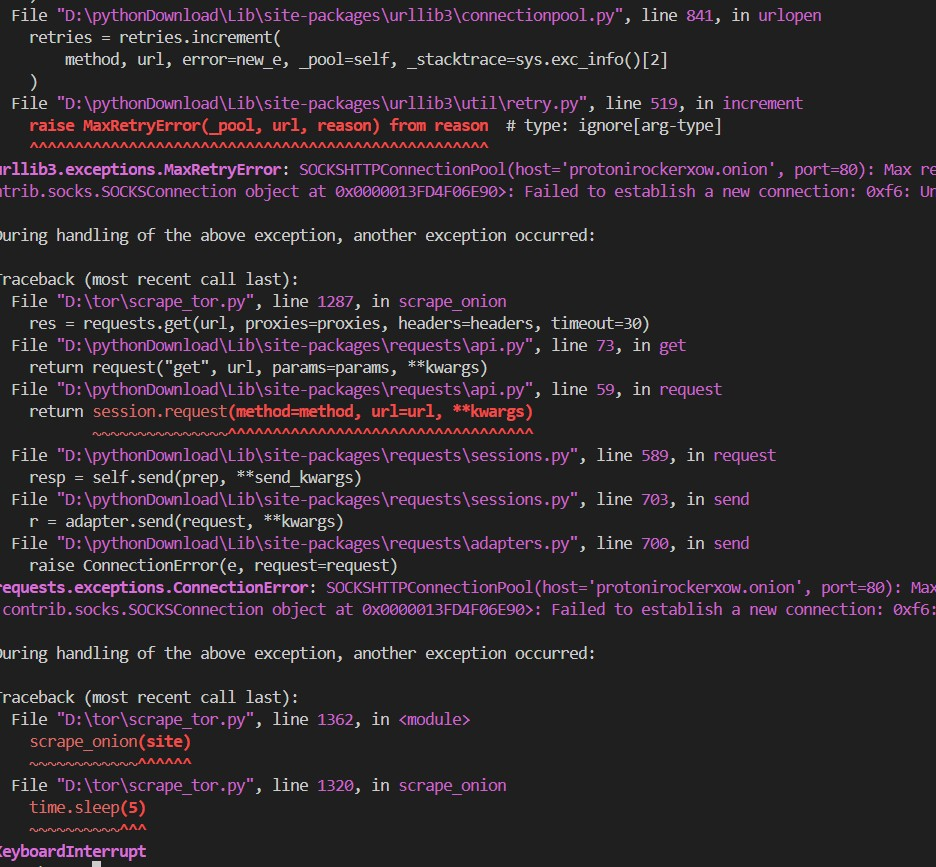
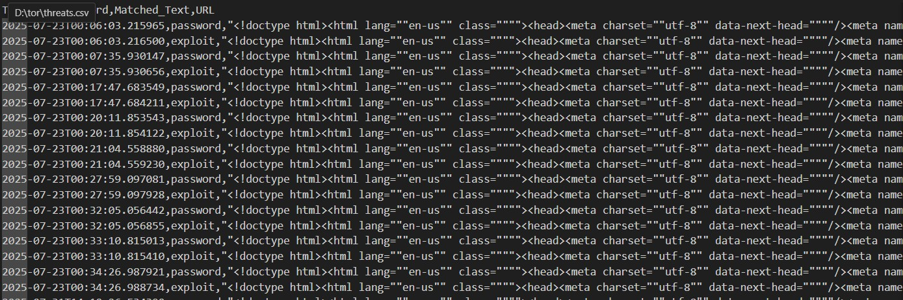

# Dark Web Threat Monitoring System

## Overview
This project scrapes known .onion websites via the Tor network, searching for threat-related keywords like "password", "exploit", and "credit card". It logs detected threats for monitoring potential data leaks or malicious activity.

## Setup
- Install [Tor Browser](https://www.torproject.org/) and start it.
- Install Python dependencies: `pip install requests[socks]`
- Run the script `python scrape_tor.py`

## How it works
- Connects to Tor proxy at 127.0.0.1:9150
- Fetches content from list of .onion URLs
- Searches for predefined keywords
- Logs findings to `threats_found.txt`
- 
## 📸 Screenshots
### 🔍 Terminal Output (Keyword Detected)

### 📂 Sample Output File (threats.csv)

### 📈 Summary Report

## Limitations
- Many .onion sites are unstable or offline.
- Only scrapes homepage currently.
- No advanced analysis or alerting yet.

## Future work
- Crawl multiple pages per site
- Summarize and visualize threat data
- Schedule periodic scraping jobs
