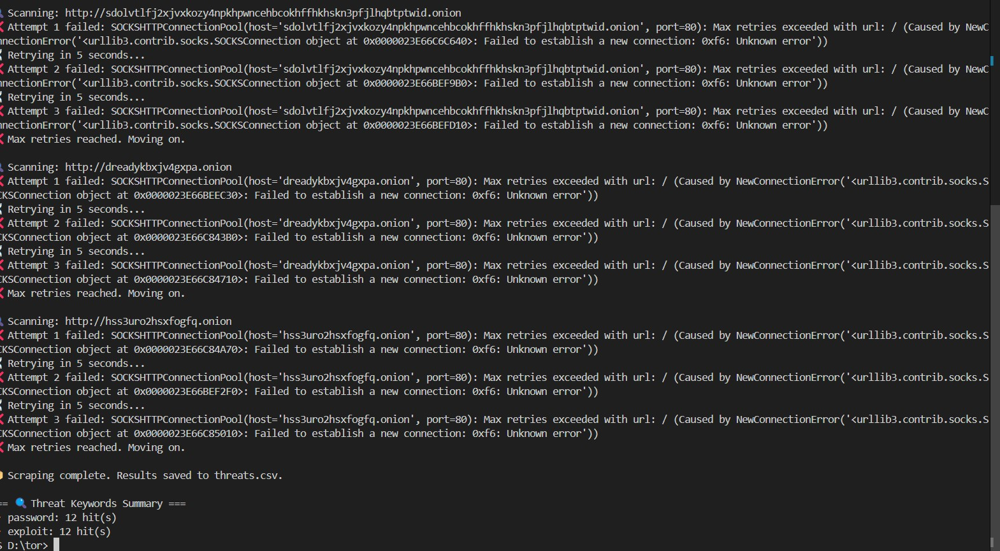

# Dark Web Threat Monitoring System

## Overview
This project scrapes known .onion websites via the Tor network, searching for threat-related keywords like "password", "exploit", and "credit card". It logs detected threats for monitoring potential data leaks or malicious activity.

## Setup
- Install [Tor Browser](https://www.torproject.org/) and start it.
- Install Python dependencies: `pip install requests[socks]`
- Run the script `python scrape_tor.py`

## Project Structure

dark-web-monitoring/
│
├── check_tor.py # Verifies Tor proxy connectivity
├── scrape_tor.py # Scrapes .onion sites and logs threats
├── threats.csv # CSV file logging detected threats
├── threads_found.txt # Optional plain-text log (human-readable)
├── requirements.txt # Python dependencies
├── screenshots/ # Folder containing screenshots and images
└── README.md

Copy
Edit

## How it works
- Connects to Tor proxy at 127.0.0.1:9150
- Fetches content from list of .onion URLs
- Searches for predefined keywords
- Logs findings to `threats_found.txt`
- 
## 📸 Screenshots

### 📈 Summary Report

## Future work
- Crawl multiple pages per site
- Summarize and visualize threat data
- Schedule periodic scraping jobs
